<p align="center">
    
</p>

<h2 align="center">ÚPadmin</h2>

<p align="center">
    Webová aplikace pro projekt <strong><a href="https://uspesnyprvnacek.cz/">Úspěšný prvňáček</a></strong>.
</p>

<p align="center">
    Read this in other languages: <strong><a href="README.md">English</a></strong>, <strong><a href="README.cs.md">Czech</a></strong>.
</p>

<p align="center">
    <a href="https://github.com/rodlukas/UP-admin/actions/workflows/test.yml"></a>
    <a href="https://codecov.io/gh/rodlukas/UP-admin"></a>
    <a href="LICENSE"></a>
    <a href="https://github.com/rodlukas/UP-admin/releases/latest"></a>
    <a href="https://github.com/rodlukas/UP-admin/releases/latest"></a>
    <br>
    <a href="https://github.com/rodlukas/UP-admin/actions/workflows/codeql.yml"></a>
    <a href="https://observatory.mozilla.org/analyze/uspesnyprvnacek.fly.dev"></a>
    <a href="https://sonarcloud.io/dashboard?id=rodlukas_UP-admin"></a>
    <a href="https://deepscan.io/dashboard#view=project&tid=8194&pid=10346&bid=141965"></a>
    <a href="https://snyk.io/"></a>
    <br>
    <a href="https://stackshare.io/rodlukas/upadmin"></a>
    <a href="https://github.com/prettier/prettier"></a>
    <a href="https://github.com/psf/black"></a>
    <br>
    <a href="https://github.com/rodlukas/UP-admin/actions/workflows/deploy.yml"></a>
    <a href="https://uspesnyprvnacek.fly.dev/"></a>
    <a href="https://uspesnyprvnacek-test.fly.dev/"></a>
</p>

<p align="center">
    <a href="https://sentry.io/organizations/rodlukas/issues/?project=1247206">Sentry</a> · 
    <a href="https://fly.io/dashboard">Fly.io</a> · 
    <a href="https://app.snyk.io/org/rodlukas/projects?groupBy=targets&searchQuery=UP-admin">Snyk</a> · 
    <a href="https://analytics.google.com/analytics/web/#/a53235943p525695113/">Google Analytics</a>
</p>

## Obsah

- [Základní informace o aplikaci](#základní-informace-o-aplikaci)
    - [Klíčové funkce](#klíčové-funkce)
    - [Použité technologie](#použité-technologie)
        - [Backend](#backend)
        - [Frontend](#frontend)
    - [Nasazené aplikace a nástroje](#nasazené-aplikace-a-nástroje)
- [Struktura repozitáře](#struktura-repozitáře)
- [Spuštění aplikace](#spuštění-aplikace)
    - [Požadavky](#požadavky)
    - [Instalace & spuštění](#instalace-&-spuštění)
    - [Pokročilá instalace bez Docker Compose](#pokročilá-instalace-bez-docker-compose)
    - [Testování](#testování)
- [Screenshoty](#screenshoty)
- [Historie](#historie)
- [Licence](#licence)

## Základní informace o této aplikaci

Webová aplikace pro projekt **[Úspěšný prvňáček](https://uspesnyprvnacek.cz/)** (mrkněte na
[jeho stránky](https://uspesnyprvnacek.cz/), také pochází z mé tvorby) – založená na technologiích
React (TypeScript), Django (Python), REST API, Django REST Framework.

Aplikaci jsem vytvořil v roce 2018 jako **bakalářskou práci na [FIT ČVUT](https://fit.cvut.cz/cs)**
– vizte [repozitář s textem bakalářské práce](https://github.com/rodlukas/bachelors-thesis). Od té
doby je v projektu [Úspěšný prvňáček](https://uspesnyprvnacek.cz/) denně úspěšně používána a její
rozšiřování a práce na ní stále pokračují ❤️. V roce 2020 jsem se také v **diplomové práci na FIT
ČVUT** věnoval všem dosavadním rozšířením aplikace o nové funkce, technologie a nástroje – vizte
[repozitář s textem diplomové práce](https://github.com/rodlukas/masters-thesis). A vývoj probíhá i
nadále.

### Klíčové funkce

V následujícím seznamu jsou nejdůležitější funkce, která aplikace poskytuje (výčet není konečný):

- **evidence klientů a skupin klientů docházejících na lekce kurzů**,
- **evidence lekcí klientů a skupin včetně předplacených – stav účasti, platba, datum, čas, zrušení,
  poznámky**,
- **evidence zájemců o kurzy**,
- **zobrazení lekcí ve 3 formách: v kartě klienta/skupiny, v diáři a na hlavní stránce v přehledu
  pro dnešní den**,
- kontrola časových konfliktů lekcí,
- automatické rušení lekcí když nikdo nemá přijít,
- automatické vytváření předplacených náhrad lekcí při omluvě předem/zrušení ze strany lektorky,
- upozornění, že má klient příště platit,
- výpočet pořadového čísla lekce s ohledem na účast klientů,
- vyhledávání klientů (fuzzy vyhledávání),
- konfigurace kurzů a stavů účasti včetně např. intuitivního nastavení zvolené barvy pro kurz,
- propojení s API _Fio banky_ – na hlavní stránce se přehledně zobrazují nedávné transakce z účtu,
- automatický odhad kurzu, data a času pro nově přidávané lekce,
- respektování a kontrola všech omezení daných danou doménou (např. duplicity),
- vedení aktivních a neaktivních klientů a skupin.

### Použité technologie

Aplikace je rozdělena na **frontend a backend**, ty spolu komunikují přes **REST API** zabezpečené
**[JWT](https://jwt.io/) autentizací**. Jako databáze se používá
[PostgreSQL 14](https://www.postgresql.org/).

> **ℹ️ Poznámka:** součástí repozitáře je také diagram nasazení a logický datový model – viz
> [`docs/README.md`](docs).

#### Backend

Obsahuje veškerou logiku a pro klienta vystavuje **REST API**, postaven na těchto technologiích:

- [Python 3.12](https://www.python.org/),
- [Django 5](https://www.djangoproject.com/),
- [Django REST framework 3](https://www.django-rest-framework.org/),
- [djangorestframework-simplejwt](https://github.com/davesque/django-rest-framework-simplejwt),
- [Pipenv](https://pipenv.pypa.io/en/latest/#install-pipenv-today),
- [a další...](/Pipfile)

V Djangu jsou pro mnohonásobné zrychlení pokročile **optimalizované komplexní SQL dotazy** (viz
články [[1]](https://www.revsys.com/tidbits/django-performance-simple-things/),
[[2]](http://ses4j.github.io/2015/11/23/optimizing-slow-django-rest-framework-performance/)).
Aplikace umožňuje **pokročilé debugování** na lokálním i vzdáleném prostředí díky
**[Django Debug Toolbar](https://github.com/jazzband/django-debug-toolbar)** a jeho doplňku
[Django Debug Toolbar Request History](https://github.com/djsutho/django-debug-toolbar-request-history/).

Pro **statickou typovou kontrolu** se napříč celým kódem používají typové anotace s použitím modulu
[typing](https://docs.python.org/3/library/typing.html), pro kontrolu typů se používá
**[mypy](http://mypy-lang.org/)** a [Pycharm](https://www.jetbrains.com/pycharm/). Pro **eliminaci
mrtvého kódu** se také používá **[vulture](https://github.com/jendrikseipp/vulture/)**.

#### Frontend

Responzivní JS _([TypeScript](https://www.typescriptlang.org/))_ webová aplikace typu SPA
([Single-Page-App](https://en.wikipedia.org/wiki/Single-page_application)) postavená na těchto
technologiích:

- [React 19](https://react.dev/),
- [TypeScript 5](https://www.typescriptlang.org/),
- [Bootstrap 5](https://getbootstrap.com/) (s [Reactstrap 9](https://reactstrap.github.io/)em),
- [FontAwesome 5 PRO](https://fontawesome.com/) (publikované do privátních Github Package Registry),
- [Tanstack Router 5](https://tanstack.com/router/),
- [Tanstack Query (dříve React Query)](https://tanstack.com/query/)
- [a další...](/frontend/package.json)

Vývoj frontendu je postaven především na:

- [Webpack 5](https://webpack.js.org/) s vlastní konfigurací (lokální i produkční) +
  [Webpack DevServer](https://webpack.js.org/configuration/dev-server/),
- [Typescript 5](https://www.typescriptlang.org/) – pro statickou typovou kontrolu,
- [vanilla-extract](https://vanilla-extract.style/) - typově bezpečná statická CSS,
- [ESlint 9](https://eslint.org/) – linter pro statickou analýzu kódu,
- [Babel 7](https://babeljs.io/),
- [husky](https://github.com/typicode/husky) a [lint-staged](https://github.com/okonet/lint-staged)
  – pre-commit kontroly (ESlint, Prettier)
- a [React Refresh](https://github.com/facebook/react/tree/main/packages/react-refresh) – pro
  [HMR](https://webpack.js.org/guides/hot-module-replacement/).

Aplikace je **odolná proti pádům JS** díky
**[React Error Boundaries](https://reactjs.org/docs/error-boundaries.html)**. Pro **zrychlení
načítání** celé aplikace se používá lazy loading
**[`React.lazy` + `React Suspense`](https://reactjs.org/docs/code-splitting.html)**.
[Webpack DevServer](https://webpack.js.org/configuration/dev-server/) je při vývoji propojený s
[Django](https://www.djangoproject.com/) dev serverem a umožňuje tak jednoduchý vývoj bez kompromisů
včetně [HMR](https://webpack.js.org/guides/hot-module-replacement/). Globální stav aplikace je
spravován přes **[React Context](https://reactjs.org/docs/context.html)**. Codebase je postavená nad
funkcionálními komponentami a **[React Hooks](https://reactjs.org/docs/hooks-intro.html)**.

### Nasazené aplikace a nástroje

Aplikace je nasazena do **2 prostředí na PaaS [Fly.io](https://fly.io/)**, které se liší příslušnou
nasazenou verzí aplikace, konkrétní instancí databáze a umožňují různé úrovně debugování. Mimo to
lze samozřejmě aplikaci spustit i v prostředí lokálním u vývojáře. Typ prostředí je také zvýrazněn
barevným štítkem v horním menu (kromě produkce).

> **Seznam prostředí:**
>
> - **lokální** – pro lokální vývoj,
> - **testing** – stejná konfigurace jako na produkci, deploy při každém commitu; umožňuje zapnout
>   debugování,
> - **produkce** – produkční verze používaná zákazníkem, deploy při release,

- Nasazené aplikace jsou **HTTPS-only** (+ pokročilé zabezpečení, viz
  [[1]](https://docs.djangoproject.com/en/2.0/howto/deployment/checklist/),
  [[2]](https://wsvincent.com/django-best-practices/)).
- Pro **automatické formátování kódů** se používá **[Black](https://github.com/psf/black)** (Python)
  a **[Prettier](https://prettier.io/)** (TS, TSX, JS, CSS, HTML, JSON, YAML, TOML, MD), oba
  nástroje jsou napojené na IDE a provádějí automatické úpravy.
- **Aplikace jsou napojené na další služby:**
    - **CI a CD** má na starost [GitHub Actions](https://github.com/features/actions) –
      automatizovaný build, testování i nasazení na různá prostředí, automaticky prováděné
      pokročilejší skripty např. pro automatické zapsání verze do aplikace, práci s tokeny, nahrání
      sestaveného frontendu do assetů k releasu na GitHubu, napojení na služby pro výpočet pokrytí
      kódu a další.
    - **Automatickou průběžnou analýzu a kontrolu kódu** včetně hodnocení kvality kódu, hledání
      potenciálních chyb a zranitelností má na starost [GitHub CodeQL](https://codeql.github.com/),
      [SonarCloud](https://sonarcloud.io/) a [DeepScan](https://deepscan.io/).
    - **Odchytávání chyb na backendu i frontendu** včetně následné evidence, notifikací a propojení
      s repozitářem zařizuje [Sentry](https://sentry.io/) (tříděné podle typu prostředí, aktivní na
      všech nasazených aplikacích). Při chybě na frontendu je možné poslat **zpětnou vazbu vázanou
      ke konkrétní chybě** díky propojení Sentry a
      [React Error Boundaries](https://reactjs.org/docs/error-boundaries.html).
    - **Sledování toku uživatelů** umožňuje napojení na
      [Google Analytics](https://analytics.google.com/) (přes modul
      [react-ga](https://github.com/react-ga/react-ga)).
- [audit-ci](https://github.com/IBM/audit-ci) se používá pro automatizovanou kontrolu zranitelných
  závislostí projektu na CI.
- Aplikace **respektuje standardy** [PEP 8](https://pep8.org),
  [12-Factor App](https://12factor.net/), [ROCA](https://roca-style.org/).
- Kompletní vývoj aplikace probíhá v IDE
  _[Pycharm (Professional Edition)](https://www.jetbrains.com/pycharm/)_ (řeší automatickou
  optimalizaci importů, automatické formátování kódů apod.).
- **Rozsáhlé testy API i UI (E2E)** jsou důležitou částí aplikace, automaticky se spouští na CI a
  lze je spustit i na lokálním prostředí. Část frontendu je navíc pokryta **unit testy**.
    - E2E testování je postaveno na **BDD frameworku [behave](https://github.com/behave/behave)** –
      testové scénáře jsou psány přirozeným jazykem (Gherkin), podle nich se spouští konkrétní
      testy.
    - Unit testy jsou postaveny na **frameworku [Vitest](https://vitest.dev/)** a nástrojích
      **[React Testing Library](https://testing-library.com/docs/react-testing-library/intro)**
      (jednoduché utility pro testování Reactu),
      [jest-dom](https://testing-library.com/docs/ecosystem-jest-dom) (custom DOM element matchers)
      a [MSW](https://mswjs.io/) (mockování API).
    - Pro **testování UI (E2E)** se používá [Selenium](https://github.com/SeleniumHQ/selenium).
    - **Podrobné informace o testech jsou v [`tests/README.md`](tests)**.

## Struktura repozitáře

```
├── .github ...... GitHub Actions konfigurace
├── .idea ........ nastavení pro IDE (Pycharm od Jetbrains)
├── admin ........ Django aplikace pro webovou aplikaci
├── api .......... Django aplikace pro REST API
├── db ........... Dockerfily pro PostgreSQL
├── docs ......... další dokumentace a soubory k aplikaci včetně diagramů
├── frontend ..... klientská část webové aplikace
├── scripts ...... skripty pro CI/CD/PaaS/instalaci
├── staticfiles .. složka pro statické soubory (prázdná, přesun až na CI)
├── tests ........ testy API i UI (e2e)
└── up ........... celý Django projekt
```

## Spuštění aplikace

Aplikaci lze spustit na lokálním prostředí ve dvou režimech. Výchozí režim je klasický vývojový –
ten obsahuje pokročilé debugovací nástroje, spouští se Django vývojový server a také
webpack-dev-server pro frontend. Vzhledem k práci s privátními GitHub Package registry (viz
[níže](#npmpro)) nelze samozřejmě bez příslušných tokenů sestavovat frontend, proto zde budu
popisovat postup spuštění ve druhém režimu – **manuální produkční verze aplikace**, tedy ta, která
je nejblíže verzi u zákazníka.

### Požadavky

Minimální požadavky jsou:

- [Git](https://git-scm.com/downloads),
- [Docker Desktop s Compose V2](https://www.docker.com/products/docker-desktop/).

### Instalace & spuštění

1.  Nejdříve **naklonujte repozitář**, otevřete jeho složku a nahrajte si **poslední produkční
    verzi** repozitáře:

    ```bash
    git clone "https://github.com/rodlukas/UP-admin.git" && cd UP-admin
    git checkout $(git describe --tags `git rev-list --tags --max-count=1`)
    ```

2.  **Vytvořte vaše lokální konfigurační prostředí ze vzorové konfigurace `.env.template`**:

    ```bash
    cp .env.template .env
    ```

3.  Použijte Docker Compose V2 pro **spuštění všech kontejnerů** 🚀:

    ```bash
    docker compose up
    ```

4.  A když kontejnery běží, ve vedlejším CLI si založte uživatelský účet:

    ```bash
    docker compose run web python manage.py createsuperuser
    ```

5.  **Aplikace je nyní dostupná na adrese <http://localhost:8000/> ✅.**

> **⚠️ Upozornění:** Docker Compose soubor používá Django dev server (ne Gunicorn), je pouze pro
> lokální testovací účely, nasazená prostředí používají Gunicorn server.

> **ℹ️ Poznámka: otevření aplikace na jiném zařízení v síti** – aplikace je připravena pro použití i
> z dalších zařízeních v síti (např. z mobilního telefonu), obvykle je potřeba provést tyto 2 kroky:
>
> 1.  povolit Python a Node.js ve firewallu (např. na chvíli aktivovat interaktivní režim ESETu),
> 2.  na mobilním zařízení zadat hostname nebo privátní IP adresu počítače, na kterém běží server.

### Pokročilá instalace bez Docker Compose

Aplikaci také můžete spustit pouze s Dockerem bez Docker Compose V2, ale je to o poznání náročnější!

<details>
<summary>Ukaž mi alternativní pokročilejší instalaci</summary>

<a name="npmpro">
  
> **ℹ️ Poznámka:** Node.js ani npm nejsou požadovány, protože ve vlastním prostředí nelze frontend sestavit (je potřeba
 přístup přes token k privátnímu GitHub Package registru pro [FontAwesome PRO](https://fontawesome.com/)). Místo toho zde použijeme 
 automaticky sestavenou poslední produkční verzi frontendu z integračního serveru (která se automaticky nahrává do assetů ke každému release).
 
</a>

1.  Nejdříve **naklonujte repozitář**, otevřete jeho složku a nahrajte si **poslední produkční
    verzi** repozitáře:

    ```bash
    git clone "https://github.com/rodlukas/UP-admin.git" && cd UP-admin
    git checkout $(git describe --tags `git rev-list --tags --max-count=1`)
    ```

2.  Stáhněte již **sestavené zdrojové kódy frontendu** z poslední produkční verze a **rozbalte** je
    přímo do repozitáře (a `frontend.zip` smažeme):

    ```bash
    wget https://github.com/rodlukas/UP-admin/releases/latest/download/frontend.zip
    unzip frontend.zip && rm frontend.zip
    ```

3.  **Vytvořte vaše lokální konfiguraci prostředí ze vzorové konfigurace `.env.template`**:

    ```bash
    cp .env.template .env
    ```

4.  Nainstalujeme všechny **závislosti pro backend** a aktivujeme virtuální prostředí Pythonu:

    ```bash
    pipenv install --dev
    pipenv shell
    ```

5.  Vytvoříme docker image a spustíme kontejner s PostgreSQL:

    ```bash
    source scripts/shell/postgresql_docker.sh
    ```

6.  **Připravíme celou Django aplikaci na spuštění** ([skript](scripts/shell/release_tasks.sh)
    nastaví výchozí soubor s nastavením Djanga, připraví statické soubory frontendu a vytvoří
    databázové schéma):

    ```bash
    source scripts/shell/release_tasks.sh
    ```

7.  A vytvoříme **uživatelský účet pro přístup do aplikace** (zadáme libovolné údaje, kterými se
    poté budeme přihlašovat):

    ```bash
    python manage.py createsuperuser
    ```

8.  💡 _(NEPOVINNÉ)_ Na závěr můžeme ještě **naplnit naši databázi
    [předpřipravenými vzorovými daty](scripts/sql/sample_data.pgsql)**, která ukážou fungování
    aplikace a usnadní první použití (obsahují několik klientů, skupin, lekcí, zájemců, kurzů a
    stavů účasti):

    ```bash
    docker exec postgresql_cz psql --dbname postgres -h localhost -U postgres -f sample_data.pgsql
    ```

### Spuštění

**Spustíme vývojový server** 🚀:

```bash
python manage.py runserver 0.0.0.0:8000
```

**✅ Aplikace je nyní dostupná na adrese <http://localhost:8000/>.**

</details>

### Testování

Můžeme také snadno spustit různé testy aplikace, například otestovat, jestli správně funguje API pro
klienty:

```bash
python manage.py behave --stage=api --tags=clients
```

Aplikace obsahuje **rozsáhlé API a UI (e2e) testy** – vizte
[podrobné informace o testech a možnostech spouštění](tests).

## Screenshoty

> **ℹ️ Poznámka:** údaje v aplikaci jsou smyšlené.

### Diář

[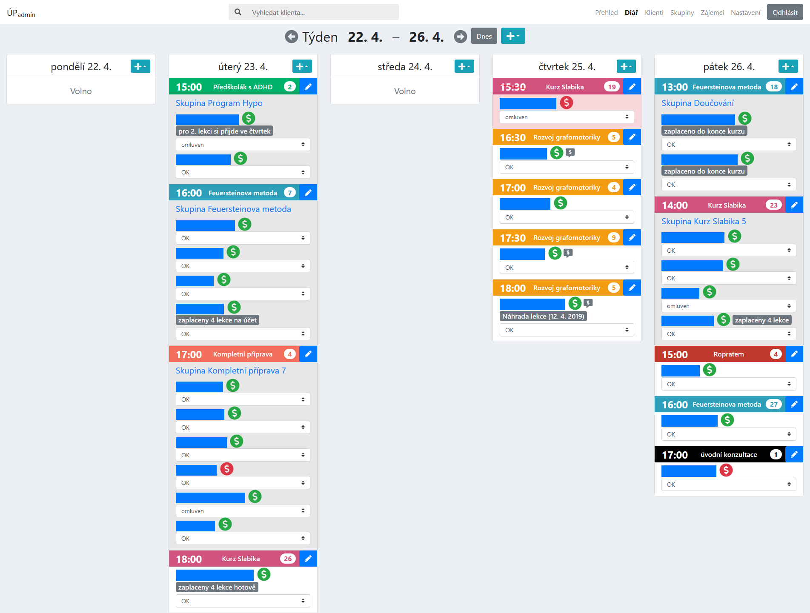](https://raw.githubusercontent.com/rodlukas/UP-admin/master/docs/screenshots/diary.png)

### Přehled (hlavní stránka)

[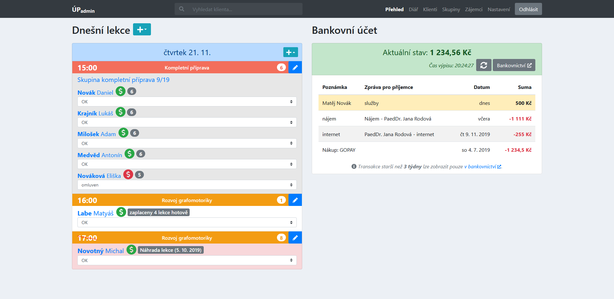](https://raw.githubusercontent.com/rodlukas/UP-admin/master/docs/screenshots/dashboard.png)

### Karta klienta / skupiny

[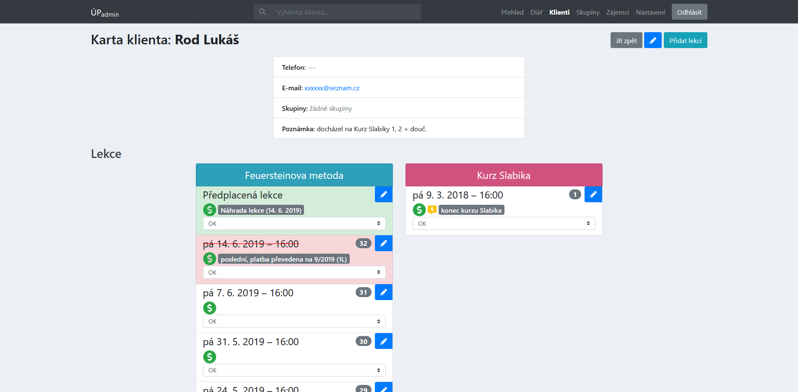](https://raw.githubusercontent.com/rodlukas/UP-admin/master/docs/screenshots/card-client.png)

[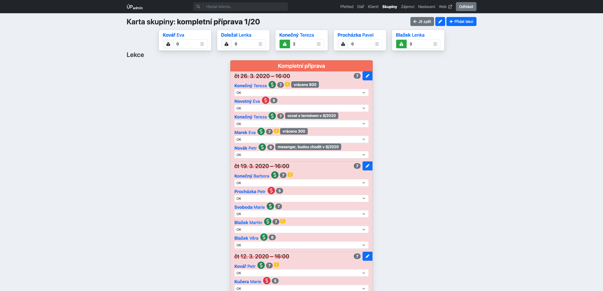](https://raw.githubusercontent.com/rodlukas/UP-admin/master/docs/screenshots/card-group.png)

### Zájemci o kurzy

[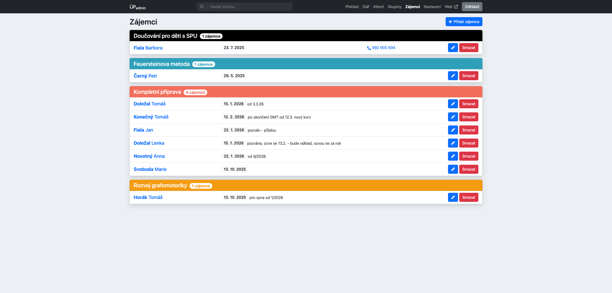](https://raw.githubusercontent.com/rodlukas/UP-admin/master/docs/screenshots/applications.png)

### Nastavení

[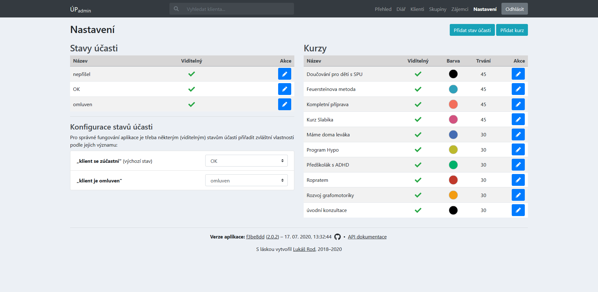](https://raw.githubusercontent.com/rodlukas/UP-admin/master/docs/screenshots/settings.png)

### Vyhledávání

[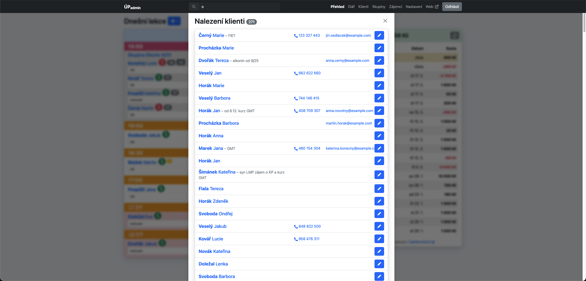](https://raw.githubusercontent.com/rodlukas/UP-admin/master/docs/screenshots/search.png)

### Výpisy

[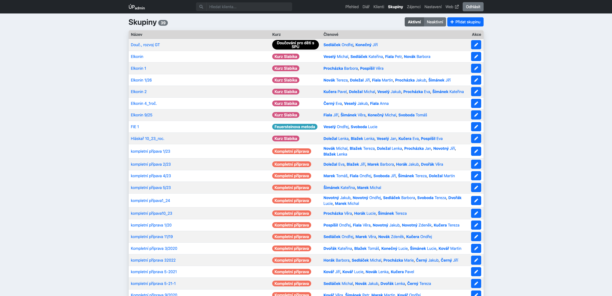](https://raw.githubusercontent.com/rodlukas/UP-admin/master/docs/screenshots/groups.png)

[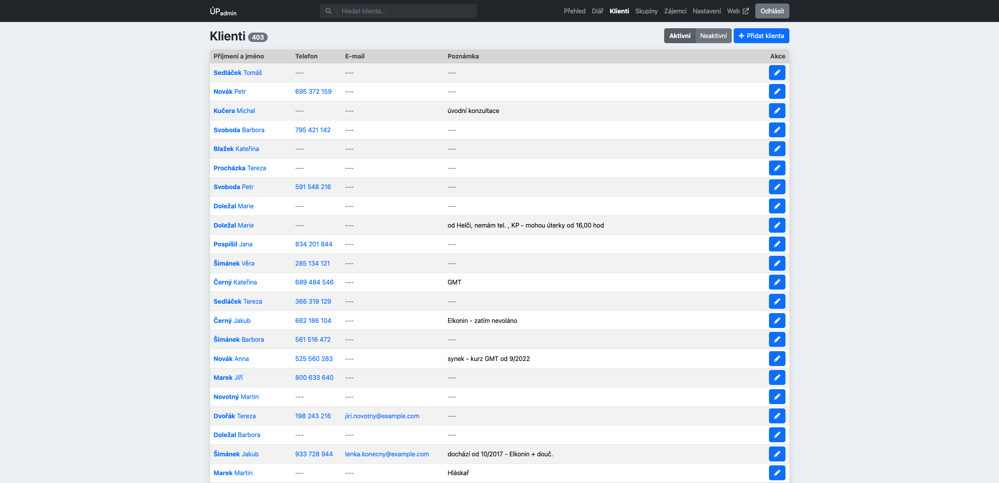](https://raw.githubusercontent.com/rodlukas/UP-admin/master/docs/screenshots/clients.png)

### Formuláře

#### Úprava skupinové lekce

[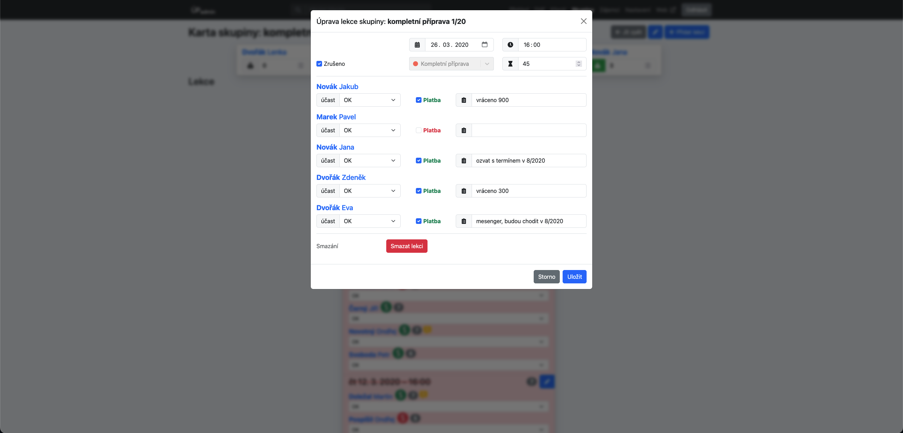](https://raw.githubusercontent.com/rodlukas/UP-admin/master/docs/screenshots/form-lecture.png)

#### Úprava údajů o skupině

[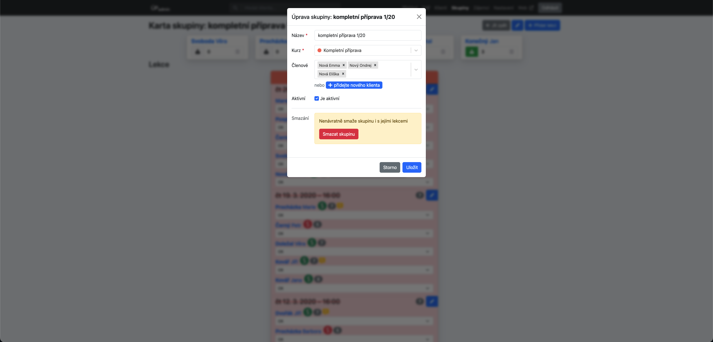](https://raw.githubusercontent.com/rodlukas/UP-admin/master/docs/screenshots/form-group.png)

## Historie

### CI

Projekt původně pro CI & CD používal [Travis](https://travis-ci.com/), ale v listopadu 2022 došlo k
migraci na GitHub Actions.

### Analýza kódu

Automatickou průběžnou analýzu a kontrolu kódu zajišťoval mj. [LGTM](https://lgtm.com/) až do
listopadu 2022, kdy byl nahrazen svým nástupcem [GitHub CodeQL](https://codeql.github.com/).

Stejně tak se postupem času měnily další nástroje pro statickou analýzu kódu a některé už i přes
svůj přínos zanikly, nebo se z nich staly větší nástroje, např. CodeBeat, DeepCode.

### PaaS

Projekt byl původně nasazen na [Heroku PaaS](https://www.heroku.com/). Zde byly 4 nezávislé běžící
instance - `testing` (automatické nasazování z master větve), `staging` (stejné jako produkce),
`produkce` a `demo` (s veřejnými přístupovými údaji a ukázkovými daty, která byla automaticky a
periodicky obnovována přes _Heroku Scheduler_). Kvůli
[oznámeným změnám cen Heroku](https://blog.heroku.com/next-chapter) bylo učiněno rozhodnutí posunout
se o dům dál. Nejprve v listopadu 2022 bylo na [Fly.io](https://fly.io/) zmigrováno testing
prostředí. Krátce nato v prosinci 2022 byla takto přesunuta i celá produkce. Migrace zahrnovala i
PostgreSQL databázi se všemi daty. Instance `staging` a `demo` byly ukončeny bez náhrady.

### Kontejnerizace

Vzhledem k tomu, že aplikace byla původně nasazena na [Heroku PaaS](https://www.heroku.com/) s
použitím jejich [Buildpacks](https://devcenter.heroku.com/articles/buildpacks), nepoužívala žádnou
formu kontejnerizace. Tento přístup měl své výhody i nevýhody. Ale vzhledem k příchodu jiných PaaS
jako [Fly.io](https://fly.io/) byla vyžadována migrace na kontejnery. To vedlo k plně
kontejnerizované aplikaci založené na Dockeru (a publikovaném obrazu v Github Container Registry). S
pomocí nově vzniklého Docker Compose V2 bylo také možné výrazné zjednodušení tohoto README pro
instalaci a spuštění, která nyní zabere jen pár řádků.

## Licence

Licencováno pod [MIT](LICENSE) licencí.

Copyright (c) 2018–2026 [Lukáš Rod](https://lukasrod.cz/)
