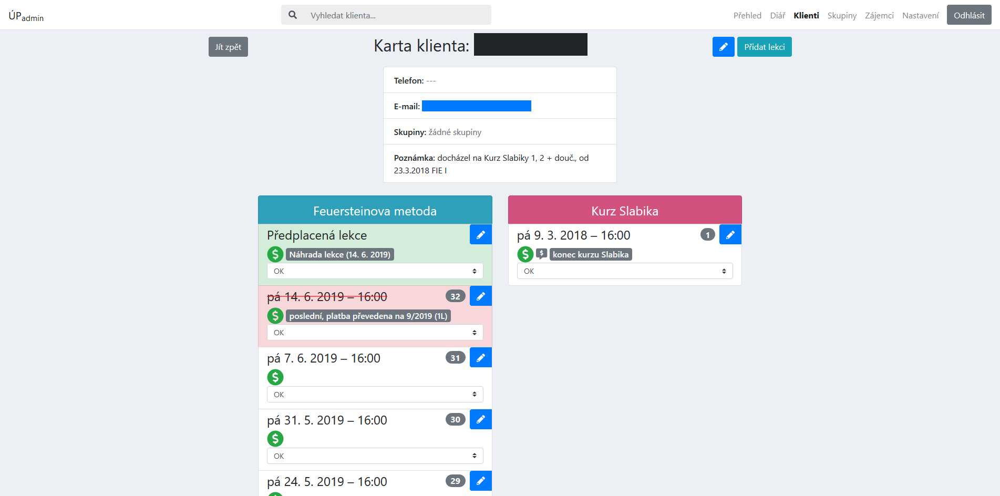

<p align="center">
    
</p>

<h3 align="center">ÚPadmin</h1>

<p align="center">
    Webová aplikace pro projekt <strong><a href="https://uspesnyprvnacek.cz/">Úspěšný prvňáček</a></strong>.
</p>

<p align="center">
    <a href="https://travis-ci.com/rodlukas/UP-admin"></a>
    <a href="https://codecov.io/gh/rodlukas/UP-admin"></a>
    <a href="LICENSE"></a>
    <a href="https://github.com/rodlukas/UP-admin/releases/latest"></a>
    <a href="https://github.com/rodlukas/UP-admin/releases/latest"></a>
    <br>
    <a href="https://lgtm.com/projects/g/rodlukas/UP-admin/alerts/"></a>
    <a href="https://lgtm.com/projects/g/rodlukas/UP-admin/context:javascript"></a>
    <a href="https://lgtm.com/projects/g/rodlukas/UP-admin/context:python"></a>
    
    
    <a href="https://deepscan.io/dashboard#view=project&tid=8194&pid=10346&bid=141965"></a>
    <br>
    <a href="https://stackshare.io/rodlukas/upadmin"></a>
    <a href="https://github.com/prettier/prettier"></a>
    <a href="https://github.com/psf/black"></a>
    <br>
    
    
    
    
</p>

<p align="center">
    <a href="https://sentry.io/uspesnyprvnacek/up-admin/">Sentry</a> · 
    <a href="https://dashboard.heroku.com/apps">Heroku</a> · 
    <a href="https://uspesnyprvnacek.slack.com/messages">Slack</a> · 
    <a href="https://analytics.google.com/analytics/web/#/report-home/a53235943w186065128p183124243">Google Analytics</a> · 
    Logentries – 
    <a href="https://addons-sso.heroku.com/apps/20c2c1b9-7573-42c9-ba22-cfdc7568f1f9/addons/551eb689-3908-4088-9100-519dfb42e836">produkce</a> / 
    <a href="https://addons-sso.heroku.com/apps/e3a9ca55-ccff-46ec-b37f-99ce57c75ee1/addons/f32bd464-be5c-4a70-bdbd-ca4b1c925803">staging</a> / 
    <a href="https://addons-sso.heroku.com/apps/20090cc9-a6a5-46f4-b6ff-516a1bb9ebf3/addons/398b1cfa-4aa4-499a-a3cd-300f2093c4b3">testing</a>
</p>

## Obsah

-   [Demo](#demo)
-   [Základní informace o aplikaci](#základní-informace-o-aplikaci)
    -   [Klíčové funkce aplikace](#klíčové-funkce-aplikace)
    -   [Použité technologie](#použité-technologie)
        -   [Backend](#backend)
        -   [Frontend](#frontend)
    -   [Informace o nasazených aplikacích](#informace-o-nasazených-aplikacích)
-   [Struktura repozitáře](#struktura-repozitáře)
-   [Spuštění aplikace na lokálním prostředí](#spuštění-aplikace-na-lokálním-prostředí)
    -   [Požadavky](#požadavky)
    -   [Instalace](#instalace)
    -   [Spuštění](#spuštění)
    -   [Testování](#testování)
-   [Screenshoty z aplikace](#screenshoty-z-aplikace)
-   [Licence](#licence)

## Demo

[**Nasazená demo verze aplikace na Heroku**](https://uspesnyprvnacek-demo.herokuapp.com/) – údaje
pro přihlášení: už. jméno `test` / heslo `test`.

> Aplikace po 30 minutách neaktivity usíná a chvíli trvá, než se probudí. Databáze v demo verzi je
> každou noc (2:00 UTC) **automaticky smazána** a naplněna
> [vzorovými daty](scripts/sql/sample_data.pgsql).

## Základní informace o aplikaci

Aplikaci jsem vytvořil v roce 2018 v rámci **bakalářské práce na FIT ČVUT** – vizte
[repozitář s textem bakalářské práce](https://github.com/rodlukas/bachelors-thesis). Od té doby je v
projektu [Úspěšný prvňáček](https://uspesnyprvnacek.cz/) denně úspěšně používána a její rozšiřování
a práce na ní stále pokračují ❤️.

### Klíčové funkce aplikace

-   **evidence klientů a skupin klientů docházejících na lekce kurzů**
-   **evidence lekcí klientů a skupin včetně předplacených – stav účasti, platba, datum, čas,
    zrušení, poznámky**
-   **evidence zájemců o kurzy**
-   **zobrazení lekcí ve 3 formách: v kartě klienta/skupiny, v diáři a na hlavní stránce v přehledu
    pro dnešní den**
-   kontrola časových konfliktů lekcí
-   automatické rušení lekcí když nikdo nemá přijít
-   automatické vytváření předplacených náhrad lekcí při omluvě předem
-   upozornění, že má klient příště platit
-   konfigurace kurzů a stavů účasti včetně např. intuitivního nastavení zvolené barvy pro kurz
-   propojení s API _Fio banky_ – na hlavní stránce se přehledně zobrazují nedávné transakce z účtu
-   automatický odhad kurzu pro nově přidávané lekce
-   respektování a kontrola všech omezení daných danou doménou (např. duplicity apod.)
-   automatické přidání předplacené lekce při omluvě/zrušení lekce ze strany lektorky
-   funkce pro vedení aktivních a neaktivních klientů a skupin
-   _... (výčet není konečný)_

### Použité technologie

Aplikace je rozdělena na **frontend a backend**, ty spolu komunikují přes **REST API** zabezpečené
**[JWT](https://jwt.io/) autentizací**. Jako databáze se používá
[PostgreSQL 12](https://www.postgresql.org/).

> **Poznámka:** součástí repozitáře je také diagram nasazení a logický datový model – viz
> [`docs/README.md`](docs).

#### Backend

Obsahuje veškerou logiku a pro klienta vystavuje **REST API**, postaven na těchto technologiích:

-   [Python 3.8](https://www.python.org/),
-   [Django 3](https://www.djangoproject.com/),
-   [Django REST framework 3](https://www.django-rest-framework.org/),
-   [djangorestframework-simplejwt](https://github.com/davesque/django-rest-framework-simplejwt),
-   [a další...](/Pipfile)

V Djangu jsou pro mnohonásobné zrychlení pokročile **optimalizované komplexní SQL dotazy** (viz
články [[1]](https://www.revsys.com/tidbits/django-performance-simple-things/),
[[2]](http://ses4j.github.io/2015/11/23/optimizing-slow-django-rest-framework-performance/)).
Aplikace umožňuje **pokročilé debugování** na lokálním i vzdáleném prostředí díky
**[Django Debug Toolbar](https://github.com/jazzband/django-debug-toolbar)** a jeho doplňku
[Django Debug Toolbar Request History](https://github.com/djsutho/django-debug-toolbar-request-history/).
Pro **eliminaci mrtvého kódu** se také používá
**[vulture](https://github.com/jendrikseipp/vulture/)**.

#### Frontend

Responzivní JS _([TypeScript](https://www.typescriptlang.org/))_ webová aplikace typu SPA
([Single-Page-App](https://en.wikipedia.org/wiki/Single-page_application)) postavená na těchto
technologiích:

-   [React 16](https://reactjs.org/),
-   [Bootstrap 4](https://getbootstrap.com/) (s [Reactstrap](https://reactstrap.github.io/)em),
-   [React Router 5](https://reacttraining.com/react-router/),
-   [FontAwesome 5 PRO](https://fontawesome.com/)
-   [a další...](/frontend/package.json)

Vývoj frontendu je postaven především na:

-   [Webpack 4](https://webpack.js.org/) s vlastní konfigurací (lokální i produkční) +
    [Webpack DevServer](https://webpack.js.org/configuration/dev-server/),
-   [Babel 7](https://babeljs.io/),
-   [Typescript 3.8](https://www.typescriptlang.org/) – pro statickou typovou kontrolu,
-   [ESlint 6](https://eslint.org/) a [stylelint](https://stylelint.io/) – lintery pro statickou
    analýzu kódu
-   a [React Hot Loader](https://github.com/gaearon/react-hot-loader) – pro
    [HMR](https://webpack.js.org/guides/hot-module-replacement/).

Aplikace je **odolná proti pádům JS** díky
**[React Error Boundaries](https://reactjs.org/docs/error-boundaries.html)**. Pro **zrychlení
načítání** celé aplikace se používá lazy loading
**[`React.lazy` + `React Suspense`](https://reactjs.org/docs/code-splitting.html)**.
[Webpack DevServer](https://webpack.js.org/configuration/dev-server/) je při vývoji propojený s
[Django](https://www.djangoproject.com/) dev serverem a umožňuje tak jednoduchý vývoj bez kompromisů
včetně [HMR](https://webpack.js.org/guides/hot-module-replacement/).

### Informace o nasazených aplikacích

Aplikace aktuálně běží na **5 prostředích** (4x PaaS [Heroku](https://www.heroku.com/)), které se
liší příslušnou nasazenou verzí aplikace, konkrétní instancí databáze, umožňují různé úrovně
debugování a kosmeticky se liší také barvou menu.

> **Seznam prostředí:**
>
> -   **vývojové (lokální)** – pro lokální vývoj _(žluté menu)_,
> -   **testing** – umožňuje zapnout debugování, deploy každého commitu _(modré menu)_,
> -   **staging** – stejná verze aplikace jako na produkci, deploy při release _(zelené menu)_,
> -   **produkce** – produkční verze používaná zákazníkem, deploy při release (jako staging) _(bílé
>     menu)_,
> -   [**demo**](https://uspesnyprvnacek-demo.herokuapp.com/) – demo verze aplikace, manuální deploy
>     z větve `demo`.

-   Nasazené aplikace jsou **HTTPS-only** (+ pokročilé zabezpečení, viz
    [[1]](https://docs.djangoproject.com/en/2.0/howto/deployment/checklist/),
    [[2]](https://wsvincent.com/django-best-practices/)).
-   Na produkci se každý den ve 3:00 provádí
    [automatická záloha databáze](https://devcenter.heroku.com/articles/heroku-postgres-backups#scheduling-backups).
-   Pro **automatické formátování kódů** se používá **[Black](https://github.com/psf/black)**
    (Python) a **[Prettier](https://prettier.io/)** (TS, TSX, JS, CSS, HTML, JSON, YAML, TOML, MD),
    oba nástroje jsou napojené na IDE a provádějí automatické úpravy.
-   **Aplikace jsou napojené na další služby:**
    -   **CI a CD** má na starost [Travis](https://travis-ci.com/) – automatizovaný build, testování
        i nasazení na různá prostředí, automaticky prováděné pokročilejší skripty např. pro
        automatické zapsání verze do aplikace, práci s tokeny, nahrání sestaveného frontendu do
        assetů k releasu na GitHubu, napojení na služby pro výpočet pokrytí kódu a další.
    -   **Automatickou průběžnou analýzu a kontrolu kódu** včetně hodnocení kvality kódu, hledání
        potenciálních chyb a zranitelností má na starost [LGTM](https://lgtm.com/),
        [SonarCloud](https://sonarcloud.io/) a [DeepScan](https://deepscan.io/).
    -   **Logování** z Heroku se zasílá do [Logentries](https://logentries.com/) (logy se uchovávají
        po 7 dnů, tříděné podle typu prostředí).
    -   **Odchytávání chyb na backendu i frontendu** včetně následné evidence, notifikací a
        propojení s repozitářem zařizuje [Sentry](https://sentry.io/) (tříděné podle typu prostředí,
        aktivní na produkci, testing i staging prostředí). Při chybě na frontendu je možné poslat
        **zpětnou vazbu vázanou ke konkrétní chybě** díky propojení Sentry a
        [React Error Boundaries](https://reactjs.org/docs/error-boundaries.html).
    -   **Sledování chování a návštěv** umožňuje napojení na
        [Google Analytics](https://analytics.google.com/) (díky modulu
        [react-ga](https://github.com/react-ga/react-ga)).
    -   [Slack](https://slack.com/)
-   Aplikace **respektuje standardy** [PEP 8](https://pep8.org),
    [12-Factor App](https://12factor.net/), [ROCA](https://roca-style.org/).
-   Kompletní vývoj aplikace probíhá v IDE
    _[Pycharm (Professional Edition)](https://www.jetbrains.com/pycharm/)_ (řeší například
    automatickou optimalizaci importů, automatické formátování kódů apod.).
-   Základ aplikace tvoří **rozsáhlé testy API i frontendu**, které se automaticky spouští na CI a
    lze je spustit i na lokálním prostředí.
    -   Testování je postaveno na **BDD frameworku [behave](https://github.com/behave/behave)** –
        testové scénáře jsou psány přirozeným jazykem, podle nich se spouští konkrétní testy.
    -   Pro **testování UI** se používá [Selenium](https://github.com/SeleniumHQ/selenium).
    -   **Podrobné informace o testech jsou v [`tests/README.md`](tests)**.

## Struktura repozitáře

```bash
├── .idea ........ nastavení pro IDE (Pycharm od Jetbrains)
├── admin ........ Django aplikace pro samotnou webovou aplikaci
├── api .......... Django aplikace pro API
├── docs ......... další dokumenty a soubory k aplikaci včetně diagramů
├── frontend ..... klientská část webové aplikace
├── scripts ...... skripty pro CI/CD/instalaci
├── staticfiles .. složka pro statické soubory (prázdná, přesun až na CI)
├── tests ........ kompletní testy API i UI (frontendu)
└── up ........... celý Django projekt
```

## Spuštění aplikace na lokálním prostředí

Aplikaci lze spustit na lokálním prostředí ve dvou režimech, výchozí je klasický vývojový – ten
obsahuje pokročilé debugovací nástroje, spouští se Django vývojový server a také webpack-dev-server
pro frontend. Vzhledem k práci s privátními npm registry (viz [níže](#npmpro)) nelze samozřejmě bez
příslušných tokenů sestavovat frontend, proto zde budu popisovat postup spuštění ve druhém režimu –
**produkční verze aplikace**, tedy ta, která je nejblíže verzi u zákazníka.

### Požadavky

Pro spuštění je potřeba mít v OS nainstalováno:

-   [Python 3.8](https://www.python.org/downloads/) (konkrétní verze viz [`Pipfile`](/Pipfile)),
-   [Pipenv](https://docs.pipenv.org/en/latest/install/#installing-pipenv),
-   [Git](https://git-scm.com/downloads),
-   [PostgreSQL 12](https://www.postgresql.org/download/).

<a name="npmpro">
  
> **Poznámka:** Node.js ani NPM/Yarn nejsou požadovány, protože ve vlastním prostředí nelze frontend sestavit (je potřeba
 přístup přes token k privátnímu npm registru pro [FontAwesome PRO](https://fontawesome.com/)). Místo toho zde použijeme 
 automaticky sestavenou poslední produkční verzi frontendu z integračního serveru (která se automaticky nahrává do assetů ke každému release).
 
</a>

### Instalace

Pokud už požadavky výše splňujete, můžeme se vrhnout na instalaci.

1.  Nejdříve **naklonujeme repozitář**, otevřeme jeho složku a nahrajeme si **poslední produkční
    verzi** repozitáře:

    ```bash
    git clone "https://github.com/rodlukas/UP-admin.git" && cd UP-admin
    git checkout $(git describe --tags `git rev-list --tags --max-count=1`)
    ```

2.  Stáhneme již **sestavené zdrojové kódy frontendu** z poslední produkční verze a **rozbalíme** je
    přímo do repozitáře (a `frontend.zip` smažeme):

    ```bash
    wget https://github.com/rodlukas/UP-admin/releases/latest/download/frontend.zip
    unzip frontend.zip && rm frontend.zip
    ```

3.  **Přejmenujeme vzorový konfigurační soubor `.env.template`** v kořenovém adresáři na **`.env`**:

    ```bash
    mv .env.template .env
    ```

4.  Pomocí **[_psql CLI_](https://www.postgresql.org/docs/current/app-psql.html)** **vytvoříme
    databázi a uživatele** pro přístup do databáze:

    ```bash
    sudo -u postgres psql -c "CREATE USER up WITH ENCRYPTED PASSWORD 'up';" -c "CREATE DATABASE up WITH OWNER up;"
    ```

5.  Nahrajeme **český balíček pro databázi** (kvůli českému řazení podle abecedy):

    ```bash
    source scripts/shell/postgresql_cs.sh
    ```

6.  Nainstalujeme všechny **závislosti pro backend** a aktivujeme virtuální prostředí Pythonu:

    ```bash
    pipenv install --dev
    pipenv shell
    ```

7.  **Připravíme celou Django aplikaci na spuštění** ([skript](scripts/shell/release_tasks.sh)
    nastaví výchozí soubor s nastavením Djanga, připraví statické soubory frontendu pro nasazení a
    vytvoří databázové schéma):

    ```bash
    source scripts/shell/release_tasks.sh
    ```

8.  A vytvoříme **uživatelský účet pro přístup do aplikace** (zadáme libovolné údaje, kterými se
    poté budeme přihlašovat):

    ```bash
    python manage.py createsuperuser
    ```

9.  💡 _(NEPOVINNÉ)_ Na závěr můžeme ještě **naplnit naší databázi
    [předpřipravenými vzorovými daty](scripts/sql/sample_data.pgsql)**, která ukážou fungování
    aplikace a usnadní první použití (obsahují několik klientů, skupin, lekcí, zájemců, kurzů a
    stavů účasti) – po zadání příkazu je vyžadováno heslo databázového uživatele `up`, které jsme
    nastavili taktéž `up`:

    ```bash
    psql --dbname up -h localhost -U up -f scripts/sql/sample_data.pgsql
    ```

### Spuštění

**Spustíme vývojový server** 🚀:

```bash
python manage.py runserver 0.0.0.0:8000
```

**✅ Aplikace je nyní dostupná na adrese <http://localhost:8000/>.**

> **Poznámka: otevření aplikace na jiném zařízení v síti** – aplikace je připravena pro použití i z
> dalších zařízeních v síti (např. z mobilního telefonu), obvykle je potřeba provést tyto 2 kroky:
>
> 1.  povolit Python a Node.js ve firewallu (např. na chvíli aktivovat interaktivní režim ESETu),
> 2.  na mobilním zařízení zadat hostname nebo privátní IP adresu počítače, na kterém běží server.

### Testování

Můžeme také snadno spustit různé testy aplikace, například otestovat, jestli správně funguje API pro
klienty:

```bash
python manage.py behave --stage=api --tags=clients
```

Aplikace obsahuje rozsáhlé API a UI testy – vizte
[podrobné informace o testech a možnostech spouštění](tests).

## Screenshoty z aplikace

> **Poznámka:** údaje v aplikaci jsou smyšlené.

### Diář

[](https://raw.githubusercontent.com/rodlukas/UP-admin/master/docs/screenshots/diary.png)

### Přehled (hlavní stránka)

[](https://raw.githubusercontent.com/rodlukas/UP-admin/master/docs/screenshots/dashboard.png)

### Karta klienta

[](https://raw.githubusercontent.com/rodlukas/UP-admin/master/docs/screenshots/card.png)

### Zájemci o kurzy

[](https://raw.githubusercontent.com/rodlukas/UP-admin/master/docs/screenshots/applications.png)

### Nastavení

[](https://raw.githubusercontent.com/rodlukas/UP-admin/master/docs/screenshots/settings.png)

## Licence

Licencováno pod [MIT](LICENSE).

Copyright (c) 2020 [Lukáš Rod](https://lukasrod.cz/)
