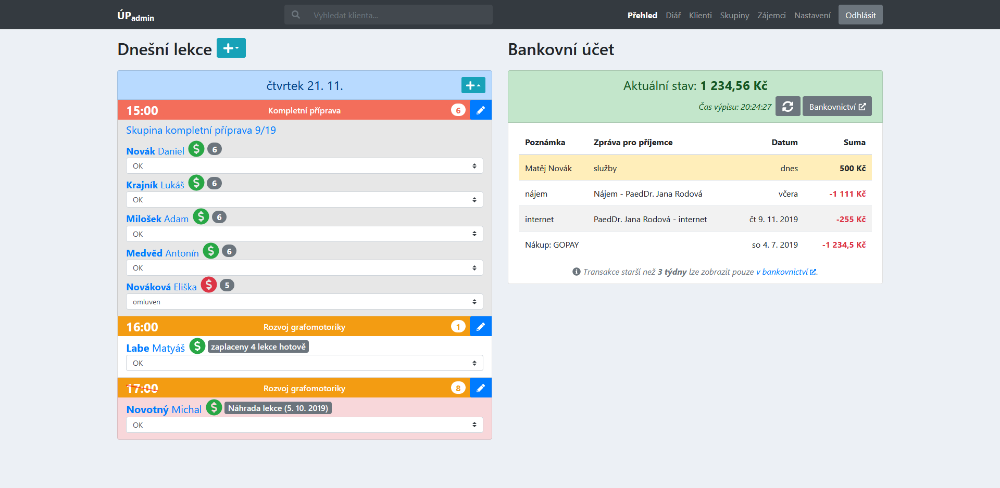
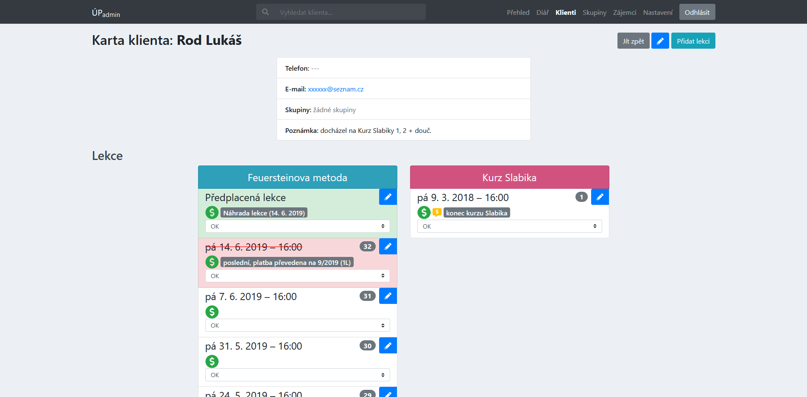
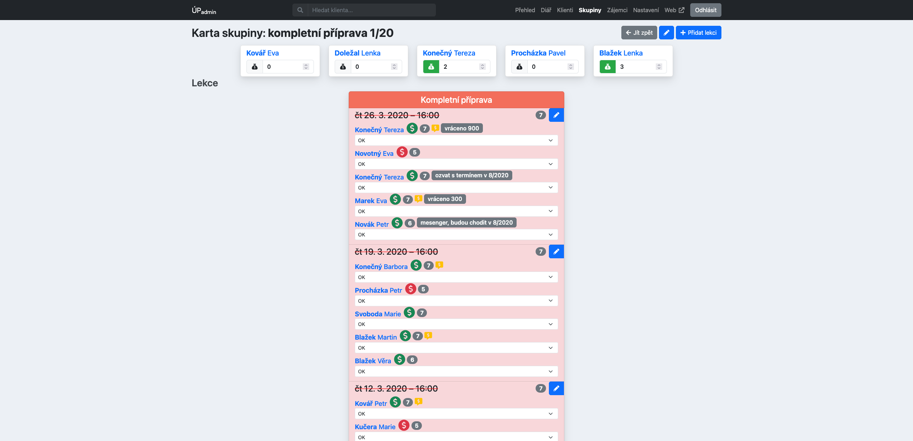
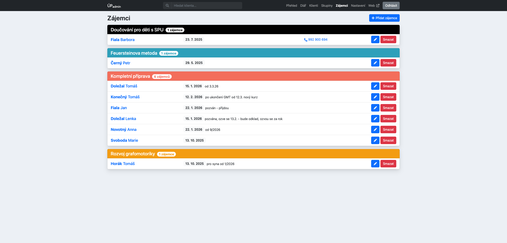
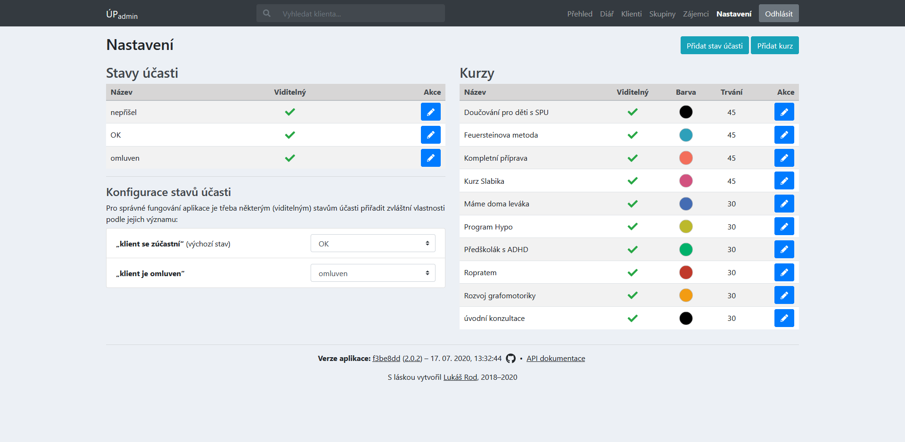
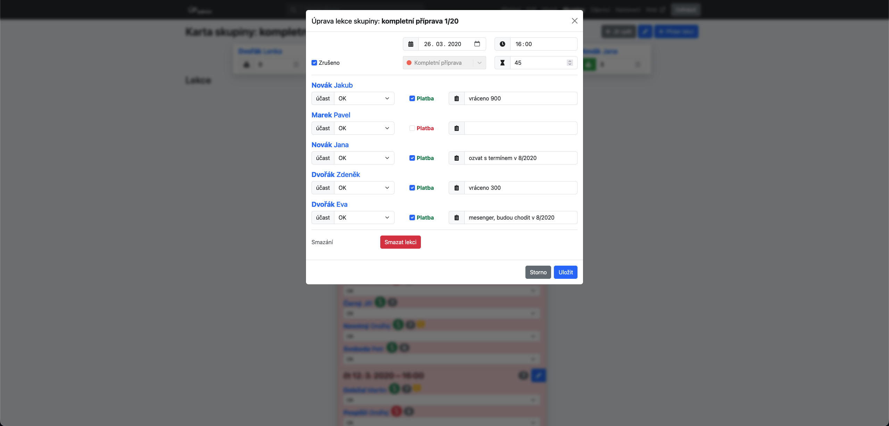
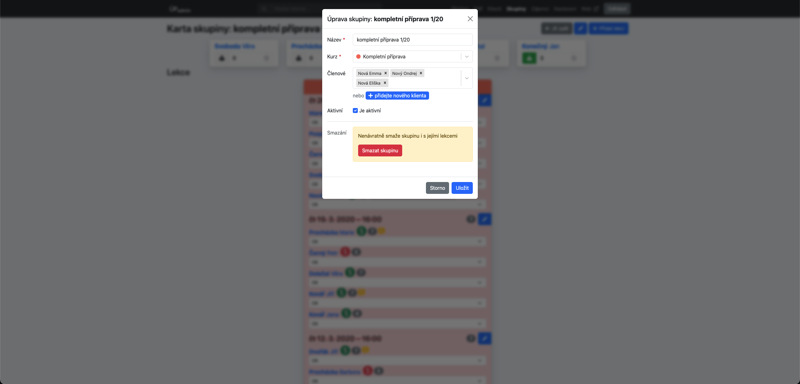

<p align="center">
    
</p>

<h3 align="center">ÚPadmin</h1>

<p align="center">
    Web application for the project <strong><a href="https://uspesnyprvnacek.cz/">Úspěšný prvňáček</a></strong>.
</p>

<p align="center">
    <strong>Read this in other languages: <a href="README.md">English</a>, <a href="README.cs.md">Czech</a></strong>.
</p>

<p align="center">
    <a href="https://github.com/rodlukas/UP-admin/actions/workflows/test.yml"></a>
    <a href="https://codecov.io/gh/rodlukas/UP-admin"></a>
    <a href="LICENSE"></a>
    <a href="https://github.com/rodlukas/UP-admin/releases/latest"></a>
    <a href="https://github.com/rodlukas/UP-admin/releases/latest"></a>
    <br>
    <a href="https://github.com/rodlukas/UP-admin/actions/workflows/codeql.yml"></a>
    <a href="https://observatory.mozilla.org/analyze/uspesnyprvnacek.herokuapp.com"></a>
    <a href="https://sonarcloud.io/dashboard?id=rodlukas_UP-admin"></a>
    <br>
    <a href="https://deepscan.io/dashboard#view=project&tid=8194&pid=10346&bid=141965"></a>
    <a href="https://codebeat.co/projects/github-com-rodlukas-up-admin-master"></a>
    <br>
    <a href="https://stackshare.io/rodlukas/upadmin"></a>
    <a href="https://github.com/prettier/prettier"></a>
    <a href="https://github.com/psf/black"></a>
    <br>
    <a href="https://uspesnyprvnacek.herokuapp.com/"></a>
    <a href="https://up-admin.fly.dev/"></a>
    <a href="https://uspesnyprvnacek-demo.herokuapp.com/"></a>
</p>

<p align="center">
    <a href="https://sentry.io/organizations/rodlukas/issues/?project=1247206">Sentry</a> · 
    <a href="https://dashboard.heroku.com/apps">Heroku</a> · 
    <a href="https://uspesnyprvnacek.slack.com/messages">Slack</a> · 
    <a href="https://www.deepcode.ai/">DeepCode</a> · 
    <a href="https://analytics.google.com/analytics/web/#/report-home/a53235943w186065128p183124243">Google Analytics</a> · 
    Logentries – 
    <a href="https://addons-sso.heroku.com/apps/20c2c1b9-7573-42c9-ba22-cfdc7568f1f9/addons/551eb689-3908-4088-9100-519dfb42e836">production</a> / 
    <a href="https://addons-sso.heroku.com/apps/20090cc9-a6a5-46f4-b6ff-516a1bb9ebf3/addons/398b1cfa-4aa4-499a-a3cd-300f2093c4b3">testing</a> / 
    <a href="https://addons-sso.heroku.com/apps/312b2926-0bff-425b-9902-f71c8b8d223b/addons/43ad6f0f-a3b8-4551-81b5-5aced9b9b143">demo</a>
</p>

## Table of Contents

-   [Demo](#demo)
-   [Basic description of the app](#basic-description-of-the-app)
    -   [Key features](#key-features)
    -   [Used technologies](#used-technologies)
        -   [Backend](#backend)
        -   [Frontend](#frontend)
    -   [Deployed apps and tools](#deployed-apps-and-tools)
-   [Repository structure](#repository-structure)
-   [Run the app](#run-the-app)
    -   [Requirements](#requirements)
    -   [Installation](#installation)
    -   [Run](#run)
    -   [Testing](#testing)
-   [Screenshots](#screenshots)
-   [License](#license)

## Demo

[**Deployed demo version of the app to Heroku**](https://uspesnyprvnacek-demo.herokuapp.com/) –
credentials: username `test` / password `test`. Note the app is not translated into English (Czech
only).

> If an app receives no web traffic in a 30-minute period, it will **sleep**, after a short delay it
> will become active again. A database in the demo version is **automatically cleaned up** and
> filled with [sample data](scripts/sql/sample_data.pgsql).

## Basic description of the app

Web application for the project **[Úspěšný prvňáček](https://uspesnyprvnacek.cz/)** (check out
[its website](https://uspesnyprvnacek.cz/), also my work) – based on a techstack: React
(TypeScript), Django (Python), REST API, Django REST Framework.

The app has been created in a **bachelor's thesis at [FIT CTU](https://fit.cvut.cz/)** – see a
[repo with the text of the bachelor's thesis](https://github.com/rodlukas/bachelors-thesis). Since
then, the app is successfully used in the project [Úspěšný prvňáček](https://uspesnyprvnacek.cz/) on
a daily basis and is constantly extended and worked on ❤️. In 2020 within a **master's thesis at
[FIT CTU](https://fit.cvut.cz/)**, I focused on all of the existing extensions of the app by new
features, technologies and tools – see a
[repo with the text of the master's thesis](https://github.com/rodlukas/masters-thesis). And of
course, the development and maintenance of this application continues.

### Key features

In the following list there are the most important features offered by this app _(the list is not
exhaustive)_:

-   **storing information about clients and groups of clients attending the lectures of courses**,
-   **storing information about lectures of the clients and groups including the prepaid ones –
    attendance state, payment, date, time, cancellation, notes**,
-   **keeping track of applicants for the courses**,
-   **3 views for the lectures: in a card of the client/group, diary and on the main page in today's
    overview**,
-   identifying time conflicting lectures,
-   automatic lecture cancellation for lectures without attendants,
-   automatic creation of the prepaid alternative lecture in case of the excuse or cancellation by a
    lecturer,
-   notification of the next lecture payment,
-   lecture number computation with respect to clients' attendances,
-   searching for clients (fuzzy searching)
-   course and attendance state configuration including e.g. an intuitive course color selection,
-   integration with the API of _Fio bank_ – on the main page there is a pretty overview of the
    latest bank transactions,
-   automatic estimation of the course, date and time for newly added lectures,
-   respecting and checking all the restrictions and limitations given by the domain (e.g.
    duplications),
-   keeping records of active and inactive clients and groups.

### Used technologies

The app is composed of the **frontend and backend** connected via a **REST API** secured using
**[JWT](https://jwt.io/) authentication**. [PostgreSQL 12](https://www.postgresql.org/) is used as a
database.

> **Note:** a part of this repo is dedicated to a deployment diagram and logical data model – see
> [`docs/README.md`](docs).

#### Backend

Includes all the logic and exposes a **REST API** for a client, built on these technologies:

-   [Python 3.10](https://www.python.org/),
-   [Django 3](https://www.djangoproject.com/),
-   [Django REST framework 3](https://www.django-rest-framework.org/),
-   [djangorestframework-simplejwt](https://github.com/davesque/django-rest-framework-simplejwt),
-   [and more...](/Pipfile)

Django complex SQL queries are highly **optimized** (multiple times speed increase) (see articles
[[1]](https://www.revsys.com/tidbits/django-performance-simple-things/),
[[2]](http://ses4j.github.io/2015/11/23/optimizing-slow-django-rest-framework-performance/)).
**Advanced debugging** in a remote/local environment is offered thanks to
**[Django Debug Toolbar](https://github.com/jazzband/django-debug-toolbar)** and its plugin
[Django Debug Toolbar Request History](https://github.com/djsutho/django-debug-toolbar-request-history/).

**Static type checking** available across the codebase based on type hints (module
[typing](https://docs.python.org/3/library/typing.html)), the checking is done via
**[mypy](http://mypy-lang.org/)** and [Pycharm](https://www.jetbrains.com/pycharm/). **Dead code
elimination** is checked with **[vulture](https://github.com/jendrikseipp/vulture/)**.

#### Frontend

Responsive JS _([TypeScript](https://www.typescriptlang.org/))_ web app, specifically SPA
([Single-Page-App](https://en.wikipedia.org/wiki/Single-page_application)) built on these
technologies:

-   [React 17](https://reactjs.org/),
-   [TypeScript 4](https://www.typescriptlang.org/),
-   [Bootstrap 4](https://getbootstrap.com/) (with [Reactstrap](https://reactstrap.github.io/)),
-   [React Router 5](https://reacttraining.com/react-router/),
-   [FontAwesome 5 PRO](https://fontawesome.com/) (published to a private Github Package Registry)
-   [a další...](/frontend/package.json)

Main tools used for the frontend development:

-   [Webpack 5](https://webpack.js.org/) with custom configuration (local and production) +
    [Webpack DevServer](https://webpack.js.org/configuration/dev-server/),
-   [Babel 7](https://babeljs.io/),
-   [Typescript 4](https://www.typescriptlang.org/) – static type checking,
-   [ESlint 8](https://eslint.org/) and [stylelint](https://stylelint.io/) – linters for static code
    analysis,
-   [husky](https://github.com/typicode/husky) and
    [lint-staged](https://github.com/okonet/lint-staged) – pre-commit checks (eslint, stylelint)
-   and [React Hot Loader](https://github.com/gaearon/react-hot-loader) – for
    [HMR](https://webpack.js.org/guides/hot-module-replacement/).

The app is **resilient against JS errors** thanks to
**[React Error Boundaries](https://reactjs.org/docs/error-boundaries.html)**.
**[`React.lazy` + `React Suspense`](https://reactjs.org/docs/code-splitting.html)** are used for
**faster loading** of the whole app.
[Webpack DevServer](https://webpack.js.org/configuration/dev-server/) is integrated in a development
phase with [Django](https://www.djangoproject.com/) dev server with all the related benefits
including [HMR](https://webpack.js.org/guides/hot-module-replacement/). A global state of the app is
managed with **[React Context](https://reactjs.org/docs/context.html)**. Part of the codebase also
takes advantage of **[React Hooks](https://reactjs.org/docs/hooks-intro.html)**.

### Deployed apps and tools

The app is deployed to **4 PaaS [Heroku](https://www.heroku.com/) environments** varying in a
version of the deployed app, database instance and debugging options. Additionally, the app can be
run in a local dev environment, of course. The type of the environment is also highlighted with a
top menu label title and color (except for the production).

> **List of environments:**
>
> -   **local** – for local development,
> -   **testing** – the same config as production, each commit is deployed here; debugging mode can be turned on,
> -   **production** – production version used by a customer, deploy of the releases,
> -   [**demo**](https://uspesnyprvnacek-demo.herokuapp.com/) – demo version of the app, manual
>     deploy from the `demo` branch.

-   Deployed apps are **HTTPS-only** (+ advanced security protection, see
    [[1]](https://docs.djangoproject.com/en/2.0/howto/deployment/checklist/),
    [[2]](https://wsvincent.com/django-best-practices/)).
-   [Automatic database backup](https://devcenter.heroku.com/articles/heroku-postgres-backups#scheduling-backups)
    is done at 3:00 (CET) in the production environment.
-   **Automatic code formatting** with **[Black](https://github.com/psf/black)** (Python) and
    **[Prettier](https://prettier.io/)** (TS, TSX, JS, CSS, HTML, JSON, YAML, TOML, MD), both these
    tools are integrated with an IDE and perform automatic enhancements.
-   **The apps are connected to more services:**
    -   **CI and CD** is taken care of by [GitHub Actions](https://github.com/features/actions) –
        automated build, testing and deployment to various environments, automated execution of
        advanced scripts for e.g. automated app version addition to app, tokens handling, uploading
        static assets (frontend) to GitHub Release Assets, integration of cloud service for
        measuring code coverage.
    -   **Automated continuous code analysis** including code quality measure, finding zero-days and
        preventing critical vulnerabilities is taken care of by
        [GitHub CodeQL](https://codeql.github.com/), [SonarCloud](https://sonarcloud.io/) and
        [DeepScan](https://deepscan.io/).
    -   **Logs** from Heroku are sent to [Logentries](https://logentries.com/) (the logs are
        retained here for 7 days, sorted according to the environment).
    -   **Error monitoring of backend and frontend** including triage, notifications and integration
        with the repo is taken care of by [Sentry](https://sentry.io/) (sorted according to the
        environment, active on deployed apps). Integrated ability to collect **additional feedback
        upon hitting an error from user** thanks to the connection of Sentry and
        [React Error Boundaries](https://reactjs.org/docs/error-boundaries.html).
    -   **User flow analysis** thanks to the integration of
        [Google Analytics](https://analytics.google.com/) (via a module
        [react-ga](https://github.com/react-ga/react-ga)).
    -   [Slack](https://slack.com/)
-   [audit-ci](https://github.com/IBM/audit-ci) is used for automated security review of the
    project's dependency tree on the CI.
-   Various **standards are enforced**: [PEP 8](https://pep8.org),
    [12-Factor App](https://12factor.net/), [ROCA](https://roca-style.org/).
-   Developed in IDE _[Pycharm (Professional Edition)](https://www.jetbrains.com/pycharm/)_ (takes
    care of automatic import optimization, automatic code formatting etc.).
-   **Complex tests of the API and UI (E2E)** are an important part of the app, the tests are
    automatically run on the CI and can also be run in the local environment. A part of the frontend
    is moreover covered with **unit tests**.
    -   E2E testing is built on a **BDD framework [behave](https://github.com/behave/behave)** –
        testing scenarios are written using a natural language (Gherkin), each of the tests is run
        according to them.
    -   Unit tests are built on a **[Jest](https://jestjs.io/) framework** and tools like
        **[React Testing Library](https://testing-library.com/docs/react-testing-library/intro)**
        (simple React testing utilities),
        [jest-dom](https://testing-library.com/docs/ecosystem-jest-dom) (custom DOM element matchers
        for Jest) and [MSW](https://mswjs.io/) (API mocking).
    -   **UI (E2E) testing** is taken care of by [Selenium](https://github.com/SeleniumHQ/selenium).
    -   **Details about the tests are available in [`tests/README.md` (CZ)](tests)**.

## Repository structure

```
├── .idea ........ IDE settings (Pycharm from Jetbrains)
├── admin ........ Django app for the web app
├── api .......... Django app for the REST API
├── docs ......... additional docs and files for the app including diagrams
├── frontend ..... frontend part of the web app
├── scripts ...... scripts for the CI/CD/PaaS/installation
├── staticfiles .. directory for static files (empty, filled on the CI)
├── tests ........ tests of the API and UI (e2e)
└── up ........... entire Django project
```

## Run the app

There are two modes that the app can be run in on the local dev environment. The default one is the
classic dev mode – this mode includes advanced debugging tools, Django dev server and
webpack-dev-server for the frontend are run. Since there is some work with private GitHub Package
registry here (see [below](#npmpro)), the frontend cannot be built without these tokens so that the
alternative way to run this app without these tokens is the second mode – **manual production
version of the app**, it's also the closest one to the customer's version, this mode will also be
run in this tutorial.

### Requirements

Minimum requirements of tools available in the target OS:

-   [Python 3](https://www.python.org/downloads/) (for a specific version see
    [`Pipfile`](/Pipfile)),
-   [Pipenv](https://pipenv.pypa.io/en/latest/#install-pipenv-today),
-   [Git](https://git-scm.com/downloads),
-   [PostgreSQL 12](https://www.postgresql.org/download/).

<a name="npmpro">
  
> **Note:** Node.js and npm are not required since the frontend cannot be built without tokens to private GitHub Package
 registry (for [FontAwesome PRO](https://fontawesome.com/)). Instead of this we'll use automatically generated assets 
 of the latest production version from the CI.
 
</a>

### Installation

Since the minimum requirements above are met, you can follow these steps then:

1.  **Clone the repo**, open its folder and download **the latest production version** of the repo:

    ```bash
    git clone "https://github.com/rodlukas/UP-admin.git" && cd UP-admin
    git checkout $(git describe --tags `git rev-list --tags --max-count=1`)
    ```

2.  Download the **prepared assets for the frontend** from the latest production version and
    **unzip** them to the repo (and remove the `frontend.zip`):

    ```bash
    wget https://github.com/rodlukas/UP-admin/releases/latest/download/frontend.zip
    unzip frontend.zip && rm frontend.zip
    ```

3.  **Rename the sample config file `.env.template`** in the root to **`.env`**:

    ```bash
    mv .env.template .env
    ```

4.  Using the **[_psql CLI_](https://www.postgresql.org/docs/current/app-psql.html)** **we'll create
    the database and user** for the access to the database:

    ```bash
    sudo -u postgres psql -c "CREATE USER up WITH ENCRYPTED PASSWORD 'up';" -c "CREATE DATABASE up WITH OWNER up;"
    ```

5.  Download a **Czech language pack for the database** (for Czech alphabetic ordering):

    ```bash
    source scripts/shell/postgresql_cs.sh
    ```

6.  Install all the **backend requirements** and activate a virtual Python environment:

    ```bash
    pipenv install --dev
    pipenv shell
    ```

7.  **Prepare the Django app for a run** (the [script](scripts/shell/release_tasks.sh) will set the
    default Django settings file, prepare the static frontend files and creates a database schema):

    ```bash
    source scripts/shell/release_tasks.sh
    ```

8.  Create a **user account for accessing the database** (choose some credentials that will be used
    for the login later):

    ```bash
    python manage.py createsuperuser
    ```

9.  💡 _(OPTIONAL)_ Finally, you can also **fill the database with some
    [prepared sample data](scripts/sql/sample_data.pgsql)** that show some great features of the app
    out of the box and make the first experience enjoyable (the sample data includes some clients,
    groups, lectures, applicants, courses and attendance states) – this script will require you to
    authenticate using the database credentials above (user `up` with the password `up`):

    ```bash
    psql --dbname up -h localhost -U up -f scripts/sql/sample_data.pgsql
    ```

### Run

**Run the dev server** 🚀:

```bash
python manage.py runserver 0.0.0.0:8000
```

**✅ The app is now available at <http://localhost:8000/>.**

> **Note: access the app from devices on the same network** – the app is ready for use from other
> network devices (e.g. smartphone), usually there are two steps required to make this happen:
>
> 1.  allow Python and Node.js in a firewall (e.g. activate an interactive mode for ESET for a
>     while),
> 2.  type the hostname or private IP address of the computer running the server to your portable
>     device.

### Testing

Various tests of the app can be executed, e.g. test of the API for clients:

```bash
python manage.py behave --stage=api --tags=clients
```

The repo contains **complex tests of the API and UI (e2e)** – see the
[details about the tests and executing options (CZ)](tests).

## Screenshots

> **Note:** personal details are fictitious.

### Diary

[](https://raw.githubusercontent.com/rodlukas/UP-admin/master/docs/screenshots/diary.png)

### Dashboard (main page)

[](https://raw.githubusercontent.com/rodlukas/UP-admin/master/docs/screenshots/dashboard.png)

### Client's / Group's card

[](https://raw.githubusercontent.com/rodlukas/UP-admin/master/docs/screenshots/card-client.png)

[](https://raw.githubusercontent.com/rodlukas/UP-admin/master/docs/screenshots/card-group.png)

### Applications for courses

[](https://raw.githubusercontent.com/rodlukas/UP-admin/master/docs/screenshots/applications.png)

### Settings

[](https://raw.githubusercontent.com/rodlukas/UP-admin/master/docs/screenshots/settings.png)

### Forms

#### Edit of a group's lecture

[](https://raw.githubusercontent.com/rodlukas/UP-admin/master/docs/screenshots/form-lecture.png)

#### Edit of group's data

[](https://raw.githubusercontent.com/rodlukas/UP-admin/master/docs/screenshots/form-group.png)

## History

-   Projekt originally used [Travis](https://travis-ci.com/) for CI & CD, but in November 2022 the
    flow was migrated to GitHub Actions.
-   Automated continuous code analysis was ensured among others by [LGTM](https://lgtm.com/) until
    November 2022 when it was replaced by its successor [GitHub CodeQL](https://codeql.github.com/).

## License

Licensed under the [MIT](LICENSE) license.

Copyright (c) 2018–2022 [Lukáš Rod](https://lukasrod.cz/)
