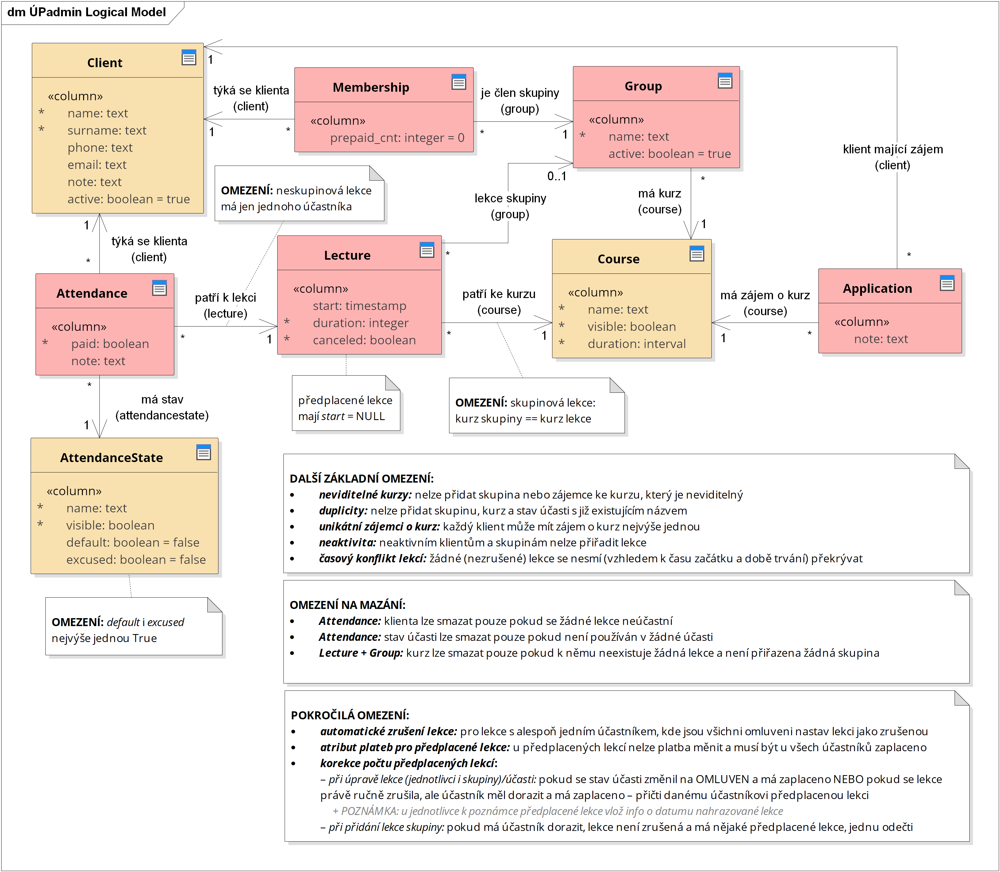
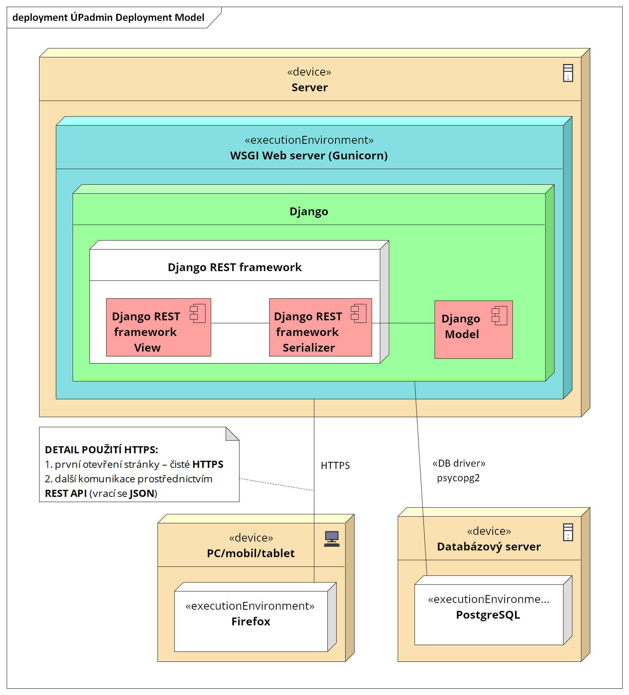

# Dokumentace k aplikaci

Zde je k dispozici několik aktuálních modelů k aplikaci. Podrobnější popis základních principů je
uveden v dřívější [bakalářské práci](https://github.com/rodlukas/bachelors-thesis/raw/master/BP.pdf)
v kapitole `6. Návrh` (viz také [repozitář práce](https://github.com/rodlukas/bachelors-thesis)).
Další informace o rozšířeném modelu jsou pak dostupné v následné
[diplomové práci](https://github.com/rodlukas/masters-thesis).

> **Info:** modely jsou vytvořeny v programu
> [Enterprise Architect 14](https://sparxsystems.com/products/ea/14/index.html), součástí tohoto
> repozitáře je příslušný [soubor s modely](EA-models.EAP).

## Logický datový model

## Diagram nasazení

## Další soubory

-   k dispozici je [několik wireframů](wireframes.epgz) použitých v bakalářské nebo diplomové práci,
    vytvořené jsou v programu [Pencil 3.1.0](https://pencil.evolus.vn/)
